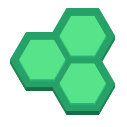
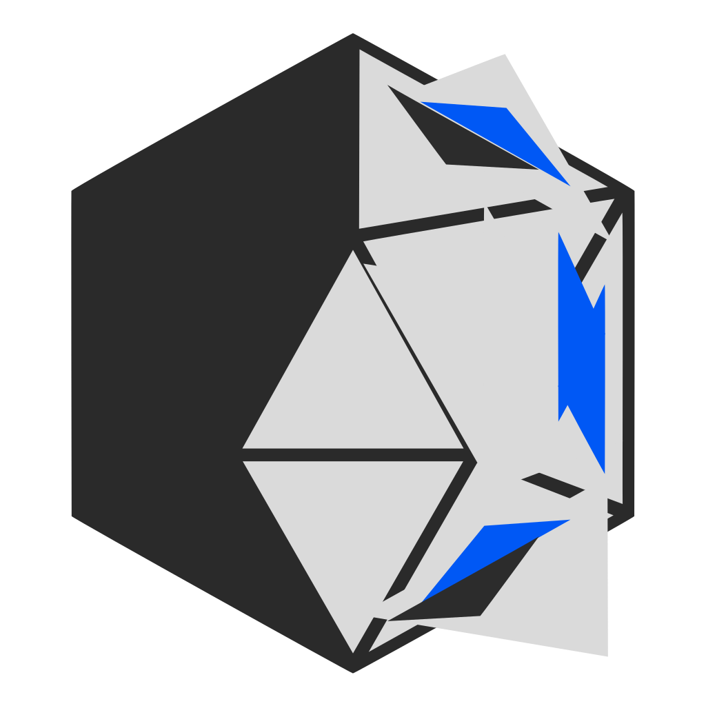

# Image Links

1.  **ADB**:
    
2.  **AIDE**:
    
3.  **Android Studio**:
    
4.  **Bash**:
    
5.  **Builder**:
    
6.  **C**:
    
7.  **CodeBoard**:
    
8.  **CSS3**:
    
9.  **Docker**:
    
10. **Elyth**:
    
11. **Figma**:
    
12. **Flask**:
    
13. **Gedit**:
    
14. **GHex**:
    
15. **Ghidra**:
    
16. **GIMP**:
    
17. **Git**:
    
18. **GitHub**:
    
19. **Glitch**:
    
20. **GNU**:
    
21. **HTML5**:
    
22. **Hugging Face**:
    
23. **Java**:
    
24. **JavaScript**:
    
25. **jQuery**:
    
26. **Kaggle**:
    
27. **Kate**:
    
28. **Kdenlive**:
    
29. **KDevelop**:
    
30. **Keras**:
    
31. **KolourPaint**:
    
32. **Krita**:
    
33. **KWrite**:
    
34. **Leetcode**:
    
35. **LibreOffice**:
    
36. **Linux**:
    
37. **Lua**:
    
38. **Node.js**:
    
39. **NumPy**:
    
40. **pygame**:
    
41. **Python**:
    
42. **Python Powered**:
    
43. **Python Turtle**:
    
44. **PyTorch**:
    
45. **React**:
    
46. **Roblox Studio**:
    
47. **Scikit-learn**:
    
48. **scipy**:
    
49. **Spck Editor**:
    
50. **SQL**:
    
51. **Syqlorix**:
    
52. **TensorFlow**:
    
53. **tkinter**:
    
54. **Vim**:
    
55. **VS Code**:
    
56. **Wonderland Editor**:
    
57. **Yolo**:
    